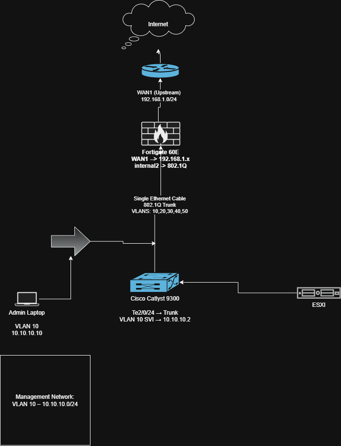

# Network Architecture Diagram

This folder will contain the architecture diagram for the enterprise cybersecurity lab.

## Components

- Verizon ONT Router
- FortiGate 60E Firewall
- Cisco Catalyst 9300 Switch
- Dell PowerEdge R630 (ESXi)

## Traffic Flow

Internet  
↓  
Verizon Router  
↓  
FortiGate Firewall  
↓  
802.1Q Trunk  
↓  
Cisco Catalyst Switch  
↓  
VLAN Segmented Networks

# Network Architecture

Below is the topology for Project 1.

